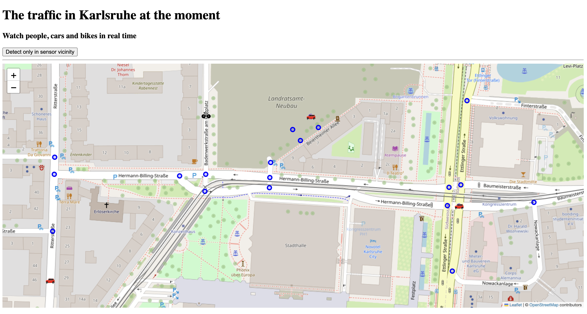

# 🛰️ KI Kommune 2024 – Verkehr in Echtzeit erleben

Willkommen bei **KI Kommune 2024** – einer interaktiven Echtzeit-Karte, die die Bewegung von Menschen, Autos und Fahrrädern in **Karlsruhe** visualisiert.
Basierend auf öffentlichen Sensordaten entsteht ein transparentes Bild der urbanen Mobilität – für eine nachhaltige, lebenswerte Stadt der Zukunft.

> ⚠️ **Hinweis:**
> Die aktuell dargestellten Verkehrsdaten sind noch **Testdaten** und dienen der Demonstration.
<!-- > Das Programm ist jedoch bereits **voll funktionsfähig** und bereit für die Anbindung realer Sensorquellen. -->

---

## 🎯 Ziel des Projekts

Diese Anwendung dient als:

- 🧭 **Tool zur intelligenten Verkehrslenkung**
- 🏙️ **Werkzeug für Stadtplanung und Mobilitätsanalysen**
- 📊 **flächendeckende Bewegungserfassung außerhalb des KFZ-Verkehrs**
- 🛣️ Beitrag zur **Verkehrswende und Klimaschutzstrategie**
- 🏆 Schritt zur **Modellstadt Freiburg/Karlsruhe** im Sinne der nachhaltigen, aktiven Mobilität

Ziel ist es, datenbasierte Entscheidungen für Infrastruktur, Verkehrsverlagerung und Umweltschutz zu unterstützen – im Sinne des Klimaschutzkonzepts 2030 und des 20-Punkte-Programms für aktive Mobilität.

---

## 🔍 Funktionen

- 📍 **Live-Kartendarstellung** mit Icons für Fußgänger, Fahrräder und Fahrzeuge
- 🧭 **Interaktive Steuerung**: Zoom, Navigation, Sensor-Fokus
- 🛑 **Filteroption**: Anzeige auf Sensor-Umfeld beschränken
- 🗂️ **Echtzeitdaten** auf OpenStreetMap-Basis via Leaflet.js

---

## 🖼️ Screenshots

### 🔹 Innenstadt von Karlsruhe

### 🔹 Detailansicht: Kongresszentrum / Hermann-Billing-Straße

## Hintergrund

Die Anwendung entstand im Rahmen des Hackathons **KI Kommune 2024**.
Ziel ist es, nutzbare Werkzeuge zu entwickeln, die den Zugang zu Verkehrsdaten erleichtern – für Planung, Forschung und städtische Entscheidungen.
